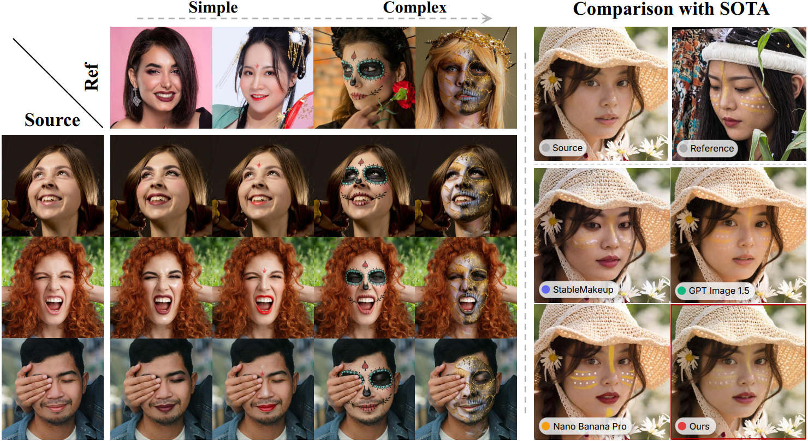
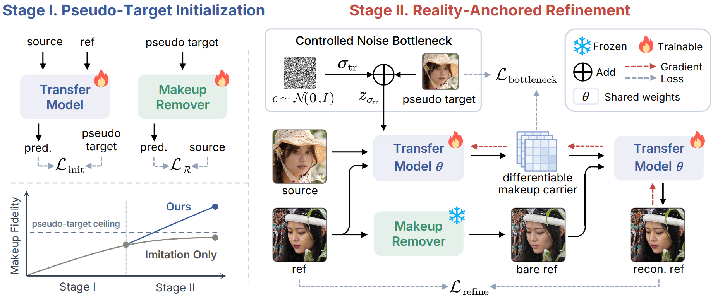
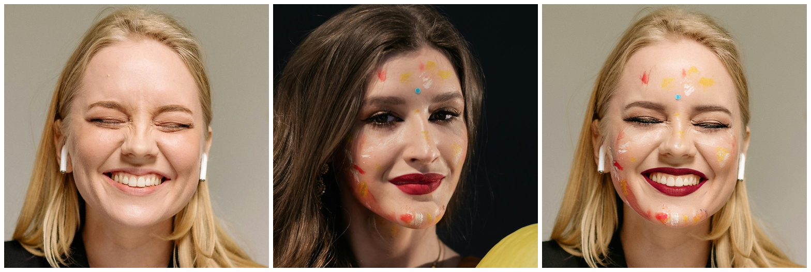
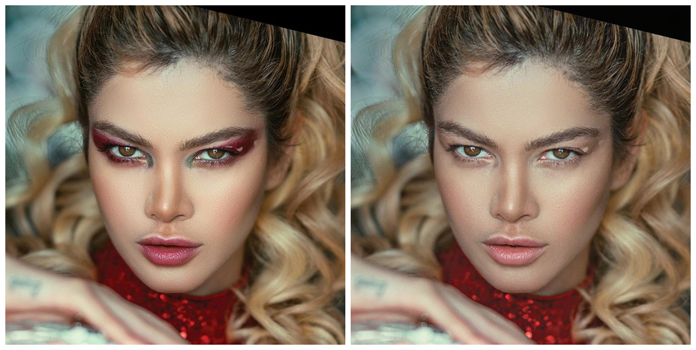
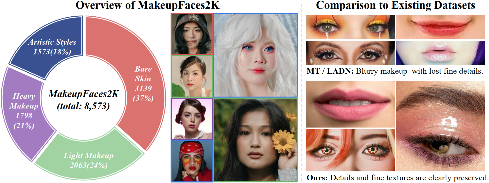

<div align='center'>
<h1 align="center">[ECCV 2026] Anchoring on Reality: Breaking the Pseudo-Target Ceiling in Makeup Transfer</h1>
    Bo Wei<sup> 1</sup>&emsp;
    <a href='https://scholar.google.com/citations?user=wLTXeNwAAAAJ&hl=en&oi=ao' target='_blank'>Xianhui Lin</a><sup> 2†</sup>&emsp;
    Yi Dong<sup> 2</sup>&emsp;
    Zhongzhong Li<sup> 2</sup>&emsp;
    Zonghui Li<sup> 2</sup>&emsp;
    <a href='https://scholar.google.com/citations?hl=en&user=BhmLztgAAAAJ' target='_blank'>Zirui Wang</a><sup> 2</sup>&emsp;
</div>

<div align='center'>
    <a href='https://scholar.google.com/citations?hl=en&user=12MzNVkAAAAJ' target='_blank'>Jiachen Yang</a><sup> 2</sup>&emsp;
    Xing Liu<sup> 2</sup>&emsp;
    Hong Gu<sup> 2</sup>&emsp;
    <a href='https://scholar.google.com/citations?hl=en&user=tmT_voUAAAAJ' target='_blank'>Xiaoming Li</a><sup> 3*</sup>&emsp;
    <a href='https://scholar.google.com/citations?hl=en&user=rUOpCEYAAAAJ' target='_blank'>Wangmeng Zuo</a><sup> 1*</sup>
</div>

<div align='center'>
    <sup>1 </sup>Harbin Institute of Technology&emsp;
    <sup>2 </sup>vivo BlueImage Lab, vivo Mobile Communication Co., Ltd&emsp;
    <sup>3 </sup>Nanjing University
</div>

<div align='center'>
    <small><sup>†</sup> Project lead</small>&emsp;
    <small><sup>*</sup> Corresponding author</small>
</div>

<div align="center">
  <p>
    <a href="https://arxiv.org/abs/2606.31089" target="_blank"></a>&nbsp;
    <a href="https://csbowei.github.io/ART/" target="_blank"></a>&nbsp;
    <a href="https://huggingface.co/csbowei/ART" target="_blank"></a>&nbsp;
    <!-- <a href="" target="_blank"></a>&nbsp;  -->
    <!-- <a href="" target="_blank"></a> -->
  </p>
</div>

## 🔍 Overview

<div align="center">

</div>

**Figure 1.** ART enables high-fidelity transfer of diverse makeup styles (simple to complex) at up to 2K resolution, while preserving identity, geometry, and makeup placement under challenging expressions, occlusions, and cross-gender scenarios.

<p align="center">
  
</p>

**Figure 2. Method overview.**
ART is a two-stage framework that shifts supervision from the synthetic pseudo-target to the real reference.
**Stage I** performs pseudo-target initialization by training the transfer model for global makeup placement and an auxiliary makeup remover for bare-skin extraction.
**Stage II** predicts a differentiable makeup carrier ẑ at noise level σ<sub>tr</sub>, and then reconstructs the real reference from its bare-skin counterpart conditioned on ẑ. Since ẑ remains differentiable, the gradient of L<sub>refine</sub> back-propagates into the transfer prediction, helping recover fine-grained makeup cues and suppress synthetic artifacts, while L<sub>bottleneck</sub> preserves the global structure.


## ✨ Highlights

⚓ **Reality-Anchored Refinement.** We propose ART, a two-stage DiT framework that breaks the *pseudo-target ceiling*. By anchoring a refinement cycle to the real reference, ART overrides pseudo-target artifacts while stabilizing training through a controlled-noise bottleneck.

💄 **A 2K-Resolution In-the-Wild Makeup Dataset.** We introduce MakeupFaces2K (MF2K), the first 2K-resolution makeup portrait dataset with 8,573 images, spanning diverse makeup intensities and underrepresented demographics to support high-fidelity makeup transfer and related tasks.

🏆 **State-of-the-Art Performance.** ART achieves superior makeup fidelity across diverse styles, consistently preserving fine-grained details and source identity even under occlusions and extreme expressions.


## 🗓️ Plan & Updates
The model weights and dataset will be released **as soon as possible** after internal review.

**Plan：**
- [x] Inference code
- [ ] 512×512 LoRA weights
- [ ] Higher-resolution weights
- [ ] Training code
- [ ] MF2K dataset


**Updates：**
- **`2026/06/30`**: We released the inference code. Continuous updates, stay tuned!


## 🚀 Getting Started

### 🛠️ 1. Environment Setup

```bash
# Create and activate environment
conda create -n art python=3.10
conda activate art

# Install dependencies
pip install -r ./requirements.txt
```

### 📦 2. Pretrained Weights

| Model | Link |
| :--- | :--- |
| ART LoRA | pending internal review |
| FLUX.1-Kontext-dev | [black-forest-labs/FLUX.1-Kontext-dev](https://huggingface.co/black-forest-labs/FLUX.1-Kontext-dev) |

### ▶️ 3. Usage

```bash
# Makeup transfer: apply the reference's makeup onto the input face
python infer.py \
    --task        mt \
    --input       ./examples/source/src_001.jpg \
    --ref         ./examples/ref/ref_001.jpg \
    --model_path  /path/to/FLUX.1-Kontext-dev \
    --lora_path   /path/to/ART_transfer_lora_512.safetensors \
    --resolution  512 \
    --output_dir  ./examples/outputs \
    --save_concat
```

```bash
# Makeup removal: strip cosmetics from the input face
python infer.py \
    --task        demakeup \
    --input       ./examples/ref/ref_002.jpg \
    --model_path  /path/to/FLUX.1-Kontext-dev \
    --lora_path   /path/to/ART_demakeup_lora_512.safetensors \
    --resolution  512 \
    --output_dir  ./examples/outputs \
    --save_concat
```

The generated results should look similar to the following:

<div align="center">
<table>
  <tr>
    <td align="center"></td>
    <td align="center"></td>
  </tr>
  <tr>
    <td align="center"><b>Makeup Transfer</b> (<code>--task mt</code>)</td>
    <td align="center"><b>Makeup Removal</b> (<code>--task demakeup</code>)</td>
  </tr>
</table>
</div>

> The `--resolution` parameter should match the resolution of the LoRA model. `--save_concat` creates a side-by-side concatenated image of the input and output.


## 📊 Datasets

### 💄 MF2K

<div align="center">

</div>

**Figure 3. MF2K, the first 2K-resolution in-the-wild makeup dataset.**
MF2K contains 8,573 images spanning four makeup intensities from bare skin to artistic styles, with broad demographic diversity.
Compared with existing datasets, it captures fine-grained makeup textures and thus serves as a demanding benchmark for high-fidelity transfer.


### 🧪 Evaluation Datasets

Our evaluation covers four datasets with complementary challenges:

- **MT**: A standard makeup-transfer dataset with mostly aligned frontal portraits under controlled settings. BeautyGAN

- **MT-Wild**: An in-the-wild makeup transfer dataset with varied poses, expressions, and backgrounds under unconstrained settings. [PSGAN](https://github.com/wtjiang98/PSGAN), [Google Drive](https://drive.google.com/drive/folders/1ubqJ49ev16NbgJjjTt-Q75mNzvZ7sEEn)

- **LADN**: A makeup transfer dataset with diverse and extreme makeup styles involving large color and spatial variations. [LADN](https://github.com/wangguanzhi/LADN), [Google Drive](https://drive.google.com/file/d/1Y0AlgKSVZNsjUG4u0YUHzoxtsG0qgexZ/view)

- **MF2K**: The artistic subset split of the MF2K dataset, emphasizing high-frequency cosmetic details for stress-testing transfer fidelity. *To be released.*


## 🙏 Acknowledgements

We sincerely thank the authors of [FLUX.1-Kontext](https://github.com/black-forest-labs/flux) for releasing the foundational generative model that our work builds upon. We also acknowledge [Diffusion-4k](https://github.com/zhang0jhon/diffusion-4k) for its inspiring wavelet loss design.

We are also grateful to previous makeup transfer works and datasets, including [PSGAN](https://github.com/wtjiang98/PSGAN), [EleGANt](https://github.com/chenyu-yang-2000/elegant), [MAD](https://basiclab.github.io/MAD/), [SHMT](https://github.com/Snowfallingplum/SHMT), [Stable-Makeup](https://github.com/Xiaojiu-z/Stable-Makeup), BeautyGAN, and [LADN](https://github.com/wangguanzhi/LADN). Their valuable contributions and released resources have inspired our research and enabled fair comparison.


## 📜 Citation

If you find our work or code useful for your research, please cite:

```bibtex
@article{wei2026art,
  title={Anchoring on Reality: Breaking the Pseudo-Target Ceiling in Makeup Transfer},
  author={Wei, Bo and Lin, Xianhui and Dong, Yi and Li, Zhongzhong and Li, Zonghui and Wang, Zirui and Yang, Jiachen and Liu, Xing and Gu, Hong and Li, Xiaoming and Zuo, Wangmeng},
  journal={arXiv preprint arXiv:2606.31089},
  year={2026}
}
```
